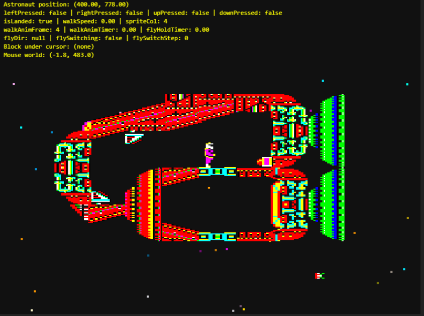

# Exile Demo



## Documentation

- [Game Guide](docs/game.md)
- [World Designer Guide](docs/world-designer.md)

## Controls

Move around with:

- Q = Left
- W = Right
- P = Up
- L = Down
- R = Remember Location
- T = Teleport

Developer toggles:

- D = Debug HUD
- Ctrl+Shift+H = Performance HUD (rolling avg/worst frame + update/map/entities/total timings)
- Ctrl+Shift+J = Periodic performance console summary (tagged with browser name)

Chunk activity tuning (devtools):

- `window.__exileDebug.chunkActivity.getTuning()` to inspect activity bands, cadence, and teleport grace window (`teleportKeepAliveMs`).
- `window.__exileDebug.chunkActivity.setTuning({...})` to tune runtime values while profiling.
- `window.__exileDebug.chunkActivity.resetTuning()` to restore defaults from `astronaut-game/src/settings.ts`.
- See [docs/game.md](docs/game.md) for rollout verification steps and tradeoffs.

## Notes

- Collision logic is almost useless - Please help!
- Don't try to fly in the ship at the moment
- Doors Unlock, Open and close
- Buttons Unlock Doors
- Sprites laid out in world_map.json, buttons.json, creatures.json, doors.json
- Palettes defined in palettes.json

### Performance baseline capture (Edge + Firefox)

1. Start the game (`npm run dev`), open devtools console, then enable `D` + `Ctrl+Shift+J`.
2. Capture 30-60 seconds in **Edge** for:
   - idle in spawn
   - active traversal/jetpack
   - heavy on-screen entity moments
3. Repeat in **Firefox** and compare `[perf][Edge]` vs `[perf][Firefox]` summaries.
4. Use `Ctrl+Shift+H` alongside debug HUD when you need in-frame timing visibility while tuning.

## Running

- Download the repo
- Run the following from the astronaut-game folder to install all packages;

```
npm install
```

- Run the following from the astronaut-game folderto run the demo;

```
npm run dev
```

- You should be able to play the demo at the following addresses;

- Local - [Exile Demo Local](http://localhost:3000)
- Prebuilt Demo - [Exile Demo PreBuilt Demo](https://exile-demo-ezg7egdpc7dwfvhk.uksouth-01.azurewebsites.net/)

## World designer

- The full editor tutorial lives in [docs/world-designer.md](docs/world-designer.md).
- The general game guide lives in [docs/game.md](docs/game.md).

## Specialist agents

- Specialist agent profiles now live under `.github/agents/`.
- Each specialist is a Markdown agent profile with YAML frontmatter.
- Current specialists:
  - `game-design-specialist.md`
  - `graphics-content-specialist.md`
  - `unit-test-specialist.md`
  - `playwright-frontend-specialist.md`
  - `collision-physics-specialist.md`
  - `animation-specialist.md`
  - `tooling-workflow-specialist.md`
  - `architecture-specialist.md`
  - `bbc-creature-mechanics-specialist.md`
  - `bbc-physics-mechanics-specialist.md`
  - `bbc-world-systems-specialist.md`
  - `bbc-audio-reference-specialist.md`
